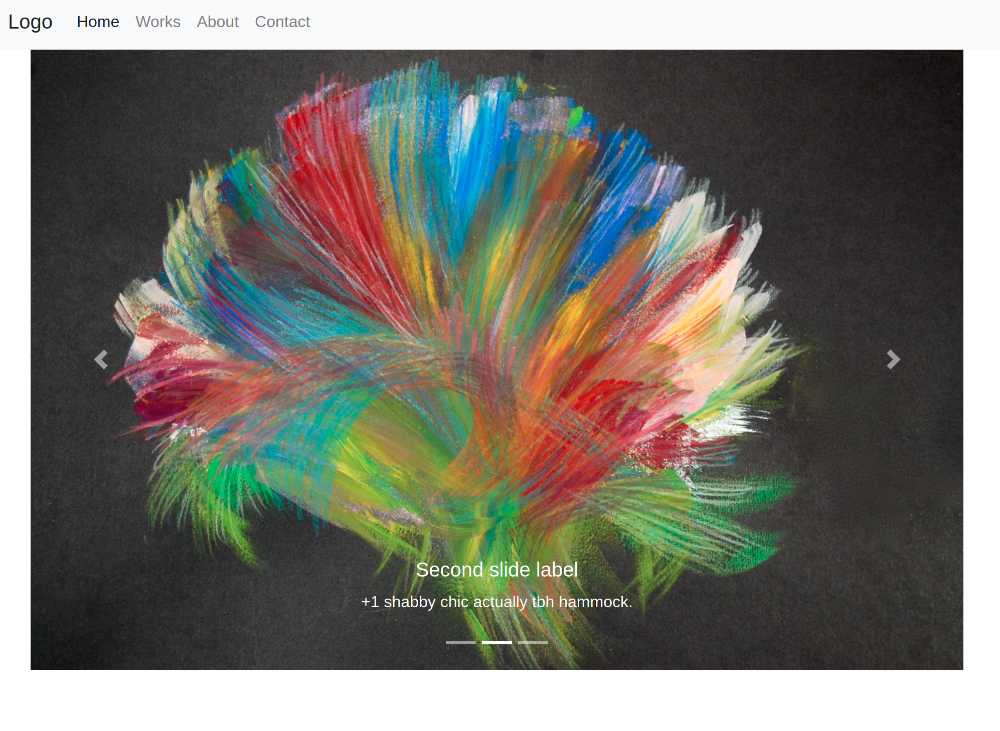

# Portfolio website template



This project is just to have some fun using Go for web development. The benefits of the language are well-documented and my intention is to make a very simple template anyone can use to build their own portfolio site. 

To get started, simply clone this repository and adjust the text in the .html files and image placeholders to suit your needs.

```
git clone https://github.com/rastringer/artist_studio
```

To run the site on localhost and begin making changes, ```cd``` into the directory and type

```
go run main.go
```

navigate to localhost:8080 and you'll see the site running.

I hope to follow up with deployment ideas, however for now, see [this primer](https://cloud.google.com/appengine/docs/standard/go/quickstart) on how to deploy such a site on Google Cloud. 
